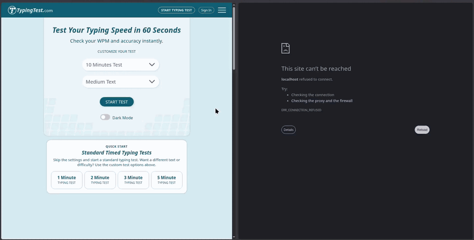

# Lightweight Autonomous Security Agents for Operator Workstations
### An Explainable XGBoost-Driven Authentication Policy
## Authors: Pál Erik, Lakatos Róbert, Prof. Dr. Hajdu András



Operator workstations in critical infrastructure, such as smart grids, and in organizations in general can act on valuable systems and data. Authentication that happens once at login cannot notice when an already-open session is taken over. Continuous authentication closes this gap, but deep learning models are too heavy to run on every workstation and usually stream the user's behavior to a central service.

In our work, we turn an accurate and efficient XGBoost keystroke-dynamics classifier into a **lightweight, autonomous security agent** that runs on the operator's own workstation. Following a **sensory–cognitive–action** cycle, the agent monitors the typing stream, forms a belief about the identity of the typist, and executes a **graded decision policy** (allow, challenge, alert, critical lockout) whose thresholds are derived from the model's own ROC curve and Equal Error Rate. Every intervention is **SHAP-explained** in the operator's own typing statistics, **audited** on a supervisor dashboard, and resolved by **operating-system re-authentication** (human-in-the-loop). The design follows the PEP-AI requirements: precise, explainable and provable AI.

The agent decides locally and works without the dashboard. Raw keystrokes, key and combination frequencies, and the model never leave the workstation; the supervisor only receives decisions, explanations and timing statistics. Because the cognitive module is a small tree ensemble, the agent needs neither a GPU nor a permanent connection, which makes a mass edge deployment in line with Green AI feasible.

The cognitive module builds on our conference work, *Accelerated Keystroke Dynamics: An XGBoost Approach to Continuous Biometric Authentication* (CITDS 2026) [[1]](#references), and its repository [[2]](#references). Compared with the LSTM-based TypeNet [[3]](#references) [[4]](#references):

| Metric | TypeNet (LSTM) | XGBoost |
|---|---|---|
| Accuracy | 98.6% | 99.8% |
| Average inference time per window | 180 ms | 63 ms |
| Peak memory usage | 145.90 MB | 20.52 MB |
| Model size | 1.99 MB | 0.18 MB |
| Training time (CPU) | 87.85 s | 1.02 s |

Under an equal-power assumption, this means about 65% less compute energy per decision and about 99% less per on-workstation adaptation (2.86× and about 86× fewer compute seconds).

In an end-to-end replay of held-out sessions through the agent, the workstation was locked for three of four impostors within 15–22 s of typing, without a false intervention on the enrolled operator. Requiring two to three consecutive suspicious windows (the confirmation buffer) removed both false interventions that a single-window policy raised. The explanations point to the features that drive the decision: resetting the five reported features to the operator's usual values removed nearly all of the model's suspicion for the window, far more than resetting five random features, and 96.6% of the reported values were outside the operator's usual range, so the operator can check them.

**Our solution is open-source. To ensure scientific reproducibility and proper attribution, any use or further development of the work is subject to appropriate citation (reference).**

Further information, additional figures, and detailed results can be found in our study [[5]](#references).

# Working of the program

```
 owner's machine (src/biometrics)                    dashboard server (server/)
 ┌─────────────────────────────────────────┐          ┌──────────────────────────┐
 │ Sensory      keylogger                  │          │ Flask + SQLite           │
 │ Cognitive    XGBoost → policy → level   │ decisions│ hosts ·                  │
 │ Explainable  SHAP: what looked wrong    │ ───────► │ incidents · statistics · │
 │ Action       actions.py → popups (HITL) │ ◄─────── │ logs · help              │
 └─────────────────────────────────────────┘  Lock /  └──────────────────────────┘
                                              Refine
```

Everything is decided on the owner's machine. The server receives only:
- host/user and model metadata;
- each incident's level, score and top reasons, plus the user's response;
- a heartbeat with the latest scores and timing statistics.

Keystrokes, key and combination frequencies, and the model never leave the
machine. The agent protects the same with or without a server. From the
dashboard, a supervisor can **Lock** a machine or ask it to **Refine** its model.

## Install

```bash
pip install -e .              # collector, training, inference, agent
pip install -e ".[server]"    # + Flask, for the dashboard server
```

The server doesn't import the `biometrics` package. To run it on a separate
machine, copy `server/` and `pip install -r server/requirements.txt`.

## Usage

The easiest way is the interactive menu: `entrypoint.sh` (runs `run.py` as
root, which the Wayland keyboard backend needs), or `python run.py`.

```bash
biometrics collect --label User     # record labelled keystroke sessions -> data/raw
biometrics process                  # raw sessions -> data/processed/data_processed.csv
biometrics train                    # model + thresholds.json + model_info.json + feature_profile.json
biometrics describe-model           # regenerate those three JSON files for an existing model, no retraining

biometrics-server                   # dashboard at http://127.0.0.1:8642/ (or: menu option 6)
biometrics infer --server http://127.0.0.1:8642   # agent, reporting to the dashboard
biometrics infer                    # agent, local only

biometrics refine                   # learn the sessions flagged for review as you, and retrain (menu option 5)
```

## The agent

Levels (`src/biometrics/agent/policy.py`), from the impostor score = the
model's probability that the typist is not the enrolled user:

| level     | when                                                               | default action          |
|-----------|--------------------------------------------------------------------|-------------------------|
| allow     | otherwise                                                          | nothing                 |
| challenge | score ≥ τ warn for 2 windows in a row                              | re-auth popup, 30 s     |
| alert     | score ≥ τ critical for 3 windows in a row, or a challenge ignored  | informational popup     |
| critical  | an alert was dismissed without re-auth, and score ≥ τ warn again   | lockout popup + dry-run enforcement hook |

τ warn and τ critical come from the model's own ROC curve at train time
(`training/thresholds.py`). A successful re-auth resets detection.

**Learning from mistakes.** If you re-authenticate at a *challenge* or an
*alert*, the model was wrong. The keystrokes of that suspicious stretch are
saved to `data/retrain_review/`, flagged for review. **Refine model** (menu,
`biometrics refine`, or the dashboard button) adds them to `data/raw/` labelled
as you (`User`), rebuilds the dataset and retrains. A running agent switches to
the new model within seconds. Re-authenticating at *critical* is never learned
from.

There is one user and one model per machine. All locations are fixed in
`src/biometrics/paths.py` (`models/xgboost`, `data/raw`, ...).

**To change what happens at each level, edit
`src/biometrics/agent/actions.py`**: `on_challenge`, `on_alert`,
`on_critical`. Reporting to the dashboard happens regardless of what those
functions do.

## Dashboard

- **Hosts**: who is connected, their current level, incidents in the last 24 h, and a **Lock** button.
- **Incidents**: a list per user. Each incident has its own page with what happened, the score on the τ scale it was decided with, the user's answer, and **what was wrong**: every flagged parameter against the user's usual range, with its SHAP score explained in words.
- **Statistics**: per user, the τ scale with live markers for the latest and recent scores, test-set performance, training parameters, a live range bar for every timing feature, and **Refine model**.
- **Logs**: every event, filterable by host and type.
- **Help**: what every value means. Each "?" on the dashboard links here.

To start over, pick **Reset dashboard** in the menu (option 8). It stops the server, deletes all dashboard data and the server log, and offers to restart it; running agents reconnect by themselves. Every page updates itself every second. Change this with `biometrics-server --refresh N` or when starting the server from the menu. New alerts and criticals pop up as toasts, and the Incidents tab counts incidents you haven't opened yet.

No authentication: run the server only where your own machines can reach it
(localhost, LAN, VPN).

## Layout

- `src/biometrics/collector`: keylogger (Wayland/uinput aware) and CSV utilities.
- `src/biometrics/processing`: raw-to-features pipeline.
- `src/biometrics/training`: XGBoost training, ROC/EER thresholds, model info, user feature profile, `review_queue.py` (flagging + refine).
- `src/biometrics/inference`: live prediction on keystroke windows.
- `src/biometrics/agent`: `agent.py` (orchestration), `policy.py`, `explain.py` (local SHAP), **`actions.py`**, `popup.py` (tkinter), `reporter.py` (to/from the server).
- `src/biometrics/cli`: the `biometrics` command.
- `server/biometrics_server`: Flask app, SQLite store, glossary, templates. Runtime data goes in `server/data/`.
- `docs/agent_design.md`: design decisions and their reasons.

Only the XGBoost path was ported here; the TypeNet/LSTM baseline was
intentionally left out (see [[2]](#references)).

# Usage and Citation
We welcome the use of our code and methodology in scientific research, or other open-source initiatives. To maintain the integrity of our work, please ensure that any use of code, data, or results from this project includes a proper reference to the original source: our journal article [[5]](#references), this repository, and the conference paper [[1]](#references).

# References

[1] E. Pál, A. Hajdu, and R. Lakatos, “Accelerated Keystroke Dynamics: An XGBoost Approach to Continuous Biometric Authentication,” in *2026 IEEE 4th Conference on Information Technology and Data Science (CITDS 2026)*, Debrecen, Hungary, 2026.

[2] E. Pál, R. Lakatos, and A. Hajdu, “Mesterséges intelligencia alapú biometrikus azonosítás,” GitHub repository. Available: https://github.com/Je-RICO-h/Mesterseges-intelligencia-alapu-biometrikus-azonositas

[3] BiDAlab, “TypeNet GitHub Repository,” [Online]. Available: https://github.com/BiDAlab/TypeNet.

[4] A. Acien, A. Morales, J. V. Monaco, R. Vera-Rodriguez, and J. Fierrez, “TypeNet: Deep Learning Keystroke Biometrics,” *IEEE Transactions on Biometrics, Behavior, and Identity Science*, vol. 4, no. 1, pp. 57–70, 2022.

[5] E. Pál, R. Lakatos, and A. Hajdu, “Lightweight, Autonomous Security Agents for Operator Workstations: An Explainable XGBoost-Driven Authentication Policy,” *Energy, Sustainability and Society*, Springer Nature, 2026.

This repository: https://github.com/Je-RICO-h/Lightweight-Autonomous-Security-Agents-for-Operator-Workstations
